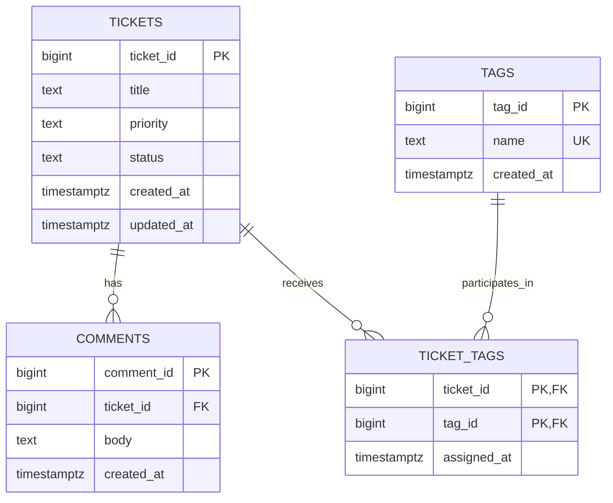

# Ticket Relational Model

## Purpose

This ERD records the relational model implemented by the Week 06 PostgreSQL
schema scripts. It keeps the database structure visible before Week 07 adds an
ORM and migrations.

## Entity Relationship Diagram

## Cardinality

- One Ticket can have zero or many comments.
- Every Comment belongs to exactly one Ticket.
- One Ticket can have zero or many Tag assignments.
- One Tag can participate in zero or many Ticket assignments.
- `ticket_tags` resolves the many-to-many relationship between Tickets and
  Tags.

## Key Rules

| Table | Rule | Guarantee |
| --- | --- | --- |
| `tickets` | `PRIMARY KEY (ticket_id)` | Every Ticket has one unique database-generated identifier. |
| `comments` | `FOREIGN KEY (ticket_id)` | A Comment cannot reference a missing Ticket. |
| `tags` | `UNIQUE (name)` | A normalized Tag name cannot be stored twice. |
| `ticket_tags` | `PRIMARY KEY (ticket_id, tag_id)` | The same Tag cannot be assigned to one Ticket twice. |
| `ticket_tags` | Two foreign keys | Every assignment references an existing Ticket and Tag. |

## Delete Behavior

- Deleting a Ticket cascades to its comments.
- Deleting a Ticket cascades to its `ticket_tags` assignment rows.
- Deleting a Tag cascades to its `ticket_tags` assignment rows.
- Deleting a Ticket does not delete reusable Tag rows.

The cascade behavior was verified inside an explicit transaction. Deleting
Ticket 5 temporarily removed its Comment and Tag assignment while preserving
the reusable `email` Tag. `ROLLBACK` restored the complete relationship state.

## Schema Sources

- `sql/001_schema.sql` defines `tickets`.
- `sql/002_relationship_schema.sql` defines `comments`, `tags`, and
  `ticket_tags`.
